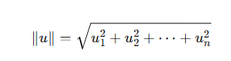
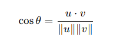
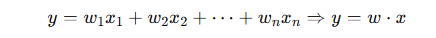

## 标量

标量是一个单一的数值，只有大小，没有方向。例子有温度、质量、时间。

### AI视角的标量
标量就是一个独立的值。
它不是一组数，也不是一个数组，更不是一个向量

可以理解成：
- 一个结果
- 一个系数
- 一个指标
- 一个超参数

### AI里常见标量
- 学习率 `lr = 0.001`
- 损失值 `loss = 0.42`
- 准确率 `acc = 0.93`
- 某个样本的预测概率`0.87`
- 某个权重参数的单独一个值

## 向量
向量是用来描述具有大小和方向的量，例如速度、力、加速度。

### AI视角的向量
向量是一组按顺序排列的数，用来表示一个对象、一个样本、一个特征集合，或者一个语义表示。
也就是说：
- 在物理里，常关心它“朝那里”
- 在AI里，常关心它“是什么”

### AI里向量常见的角色
- 一个样本的特征
- 一个用户画像
- 一个商品画像
- 一个单词/句子的 embedding
- 一张图片提取后的特征
- 一组模型权重

### 例子
比如一个房屋样本：
```
x = [rooms, size, floor]
x = [3, 100, 2]
```
这个就是向量。
它强调
- 第一维是房间数
- 第二维是面积
- 第三维是楼层

### 向量的表示方式
- 符号表示
- 分量表示：(3, 4)
- 基底表示
- 矩阵表示：列向量或行向量

### AI视角的向量表示
- 列表式表示：[x1, x2, x3]
- 列向量/行向量表示
- shape 表示

### 维度概念
一个向量里有几个数就是几个维度，比如`[1,2,3]`就是3维向量。这个维度是这个向量里有多少个数值特征。

## 向量的大小：模长/范数

在AI里，向量模长常用于：
- 归一化
- 距离计算
- 相似度计算
- 数值稳定处理



### 直觉理解：
如果把向量看成一个箭头，模长就是箭头长度
如果把向量看成一组特征，模长则表示这组值整体有多大。

例如向量：`u=(4,3)`
则模长为：`||u|| = sqrt(4^2 + 3^2) = 5`

## 向量相似度衡量
- 余弦相似度 
- 距离计算


它在 AI 里表示什么

它衡量的是两个向量的“方向是否接近”。

- 越接近 1：越相似
- 越接近 0：相关性越弱
- 越接近 -1：方向越相反

### 距离
```
∥w∥=∥u−v∥
```
意思是：两个向量相间后，再看结果向量的长度

它衡量的是两个向量再空间里相隔多远。
- 距离越小：越相近
- 距离越大：越不相近

## 向量用法：表示特征
例如向量：
```
x=[rooms,size,floor,…]
x=[3,100,2,…]
```

这个叫特征向量

### 特征向量
特征向量就是：
把一个对象的多个属性，按顺序排成一组数。

比如房屋预测：房间数、面积、楼层、是否靠近地铁、朝向编码，可以组成一个向量。

## 点积

向量如何产生标量结果



这里
- x 是输入特征向量
- w 是权重向量
- w · x 是点积
- y 是输出结果

点积会把两个同为向量中对应位置相乘，然后相加，最后得到一个数。
这就是向量→标量的典型过程

## 向量进阶用法 embedding
比如
```
 猫 = [0.5, 0.8, 0.2]
```

embedding可以理解成把一个词、句子、图片、用户、商品，映射成一个向量。

## 向量标量的关系
- 标量：一个值
- 向量：一组值

### 一个典型的AI过程
- 先把对象表示成向量
- 用向量参与计算
- 得到一个标量结果或新的向量表示
例如
- 输入文本 → 句向量
- 句向量和查询向量比较 → 得到相似度分数
- 这个分数就是标量