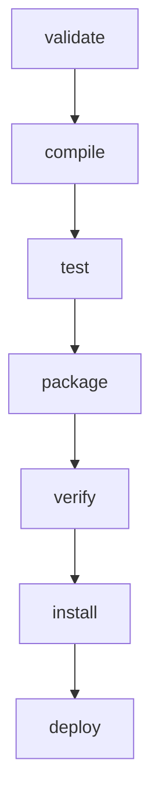

# Maven 

Java项目引入maven操作就是根目录加一个`pom.xml`文件

## Maven 是什么？

Maven 是一个项目管理工具。

## Maven 有什么用？

Maven 可以对 Java 项目进行构建、依赖管理。

## 什么是构建（build）？

构建是以源代码（例如 Java 代码、配置文件）为原材料，生产出可以运行的项目（例如 war 包）的过程。

## 仓库
仓库：用于存储资源，各种 jar 包。
### 仓库分类：
- 本地仓库：自己电脑上的仓储，从远程仓库获取资源
- 远程仓库：
    - 中央仓库：Maven 团队维护的仓库，包含所有开源资源
    - 私服：公司或其他组织维护的仓库，包含从中央仓库获取的资源和内部资源
    
为什么要有私服？
    - 提升本地资源获取速度，本地仓库直接从私服获取资源，不需要每次都请求中央仓库
    - 保存内部资源

```text
    本地仓库  --->  私服  --->  中央仓库
```
## 坐标

**Maven 坐标的作用**
  - 用于描述资源在仓库中的位置。
  - Maven 根据坐标来定位资源。

**Maven 坐标的组成**
  - **groupId**
    - 组 ID。
    - 表示所属的组织名称。
    - 通常是域名反写。
    - 例如：`com.jirengu`

  - **artifactId**
    - 项目名称。
    - 例如：`bank`、`hotel`

  - **version**
    - 版本号。

- **Maven 仓库查询地址**
  - https://mvnrepository.com/

- **依赖示例**
    ```xml
    <!-- https://mvnrepository.com/artifact/javax.servlet/javax.servlet-api -->
    <dependency>
        <groupId>javax.servlet</groupId>
        <artifactId>javax.servlet-api</artifactId>
        <version>4.0.1</version>
        <scope>provided</scope>
    </dependency>
    ```

## 仓库配置

### 本地仓库配置

- 通常不需要配置。
  - 因为 IDEA 初次使用 Maven 时，会在默认位置自动创建本地仓库。

- 默认本地仓库位置：

```text
C:\Users\username\.m2\repository
```

- 在 `M2_HOME\conf\settings.xml` 中可以配置仓库位置。

- 如果要手动配置本地仓库：
  - 进入用户目录：

```text
C:\Users\username\
```

  - 输入 `mvn` 命令。
  - Maven 会创建一个空的本地仓库。

### 远程仓库配置

- 如果 A 仓库能提供 B 仓库的所有资源，那么可以认为 A 是 B 的镜像。

- 配置镜像可以加快资源获取速度。

- 镜像不是私服，镜像也对外公开。

- 修改 `settings.xml` 文件配置镜像。

### 镜像配置示例

```xml
<mirror>
    <id>alimaven</id>
    <name>aliyun maven</name>
    <url>https://maven.aliyun.com/repository/public</url>
    <mirrorOf>central</mirrorOf>
</mirror>
```

## pom.xml 配置文件的结构

### POM 简介

- POM（Project Object Model），项目对象模型。
- Maven 将项目开发和管理过程抽象成一个项目对象模型（POM）。
- `pom.xml` 配置文件描述了项目的信息，Maven 通过加载 `pom.xml` 掌握项目信息。

### 基础 pom.xml 文件结构

一个基础的 `pom.xml` 文件结构可以分为 3 大块：

- 基本信息
- 坐标配置
- 依赖配置

### 示例

```xml
<project xmlns="http://maven.apache.org/POM/4.0.0"
         xmlns:xsi="http://www.w3.org/2001/XMLSchema-instance"
         xsi:schemaLocation="http://maven.apache.org/POM/4.0.0 http://maven.apache.org/xsd/maven-4.0.0.xsd">

  <!-- 1. 基本信息 -->
  <modelVersion>4.0.0</modelVersion>
  <name>nonWebapp</name>

  <!-- 2. 坐标信息 -->
  <groupId>com.jirengu</groupId>
  <artifactId>nonWebapp</artifactId>
  <version>1.0-SNAPSHOT</version>
  <packaging>jar</packaging>

  <!-- 3. 依赖配置 -->
  <dependencies>
    <dependency>
      <groupId>junit</groupId>
      <artifactId>junit</artifactId>
      <version>4.13.2</version>
      <scope>test</scope>
    </dependency>
  </dependencies>

</project>
```

## Maven 项目构建与生命周期

### 1. 什么是生命周期？

- 生命周期用来表示一个生物从出生到死亡的过程。
- 在软件开发领域，生命周期用来表示一个对象从创建到销毁的过程。
- Maven 用生命周期定义了项目构建和发布的过程，定义了生命周期包含哪些阶段。

### 2. Maven 生命周期

- clean：项目清理
    - `pre-clean`：执行一些需要在 `clean` 之前完成的工作
    - `clean`：移除所有上一次构建生成的文件
    - `post-clean`：执行一些需要在 `clean` 之后立刻完成的工作
- default（或 build）：项目部署 > 重点！！！
- site：项目站点文档创建的处理 > 使用较少

### 3. default 生命周期

| 阶段 | 处理 | 描述 |
|---|---|---|
| 验证 `validate` | 验证项目 | 验证项目是否正确且所有必须信息是可用的 |
| 编译 `compile` | 执行编译 | 源代码编译在此阶段完成 |
| 测试 `test` | 测试 | 使用适当的单元测试框架（例如 JUnit）运行测试 |
| 包装 `package` | 打包 | 创建 JAR/WAR 包，如在 `pom.xml` 中定义提及的包 |
| 检查 `verify` | 检查 | 对集成测试的结果进行检查，以保证质量达标 |
| 安装 `install` | 安装 | 安装打包的项目到本地仓库，以供其他项目使用 |
| 部署 `deploy` | 部署 | 拷贝最终的工程包到远程仓库中，以共享给其他开发人员和工程 |

### 4. default 生命周期执行顺序



> Maven 在一个生命周期中，运行某个阶段的时候，它之前的所有阶段都会被运行。

## Maven 依赖管理

### 1. 依赖配置

Maven 的依赖需要配置在 `<dependencies>` 标签中。

一个依赖对应一个 `<dependency>` 标签，每个依赖都需要指定 Maven 坐标：

- `groupId`：组织或公司标识
- `artifactId`：项目或模块名称
- `version`：版本号

示例：

```xml
<dependencies>
  <dependency>
    <groupId>org.example</groupId>
    <artifactId>maven02</artifactId>
    <version>1.0-SNAPSHOT</version>
  </dependency>

  <dependency>
    <groupId>org.example</groupId>
    <artifactId>maven03</artifactId>
    <version>1.0-SNAPSHOT</version>
  </dependency>
</dependencies>
```

### 2. 依赖传递

Maven 依赖具有传递性。

#### 直接依赖

当前项目在 `pom.xml` 中直接配置的依赖。

例如：

```text
maven05 -> maven04
maven05 -> maven02
```

对于 `maven05` 来说，`maven04` 和 `maven02` 是直接依赖。

#### 间接依赖

当前项目依赖的资源，又依赖了其他资源。

例如：

```text
maven05 -> maven04 -> maven03 -> maven06
maven05 -> maven02 -> maven01
```

对于 `maven05` 来说，`maven03`、`maven01`、`maven06` 是间接依赖。

### 3. 依赖冲突

依赖冲突通常是因为多个间接依赖引入了同一个 jar 包的不同版本。

例如：

```text
maven05 -> maven04 -> maven03 -> maven01:1.1
maven05 -> maven02 -> maven01:1.0
```

此时项目中同时出现了 `maven01` 的两个版本：

- `maven01:1.1`
- `maven01:1.0`

Maven 需要根据规则选择最终使用哪个版本。

### 4. 依赖冲突解决规则

#### 路径优先

依赖层级越浅，优先级越高。

```text
maven05 -> maven02 -> maven01:1.0
maven05 -> maven04 -> maven03 -> maven01:1.1
```

`maven01:1.0` 路径更短，因此优先使用 `1.0`。

#### 声明优先

当依赖层级相同时，先声明的依赖优先。

```text
maven05 -> maven03 -> maven01:1.1
maven05 -> maven02 -> maven01:1.0
```

如果 `maven03` 在 `pom.xml` 中先声明，则优先使用 `maven01:1.1`。

#### 同一个配置文件中的重复依赖

如果在同一个 `pom.xml` 中重复配置同一个依赖，靠后的配置会覆盖靠前的配置。

```xml
<dependencies>
  <dependency>
    <groupId>org.example</groupId>
    <artifactId>maven01</artifactId>
    <version>1.1</version>
  </dependency>

  <dependency>
    <groupId>org.example</groupId>
    <artifactId>maven01</artifactId>
    <version>1.0</version>
  </dependency>
</dependencies>
```

最终使用：

```text
maven01:1.0
```

### 5. 查看依赖冲突

#### 方法一：命令行查看

```bash
mvn -Dverbose dependency:tree
```

示例输出：

```text
[INFO] org.example:untitled1:jar:1.0-SNAPSHOT
[INFO] +- org.example:maven02:jar:1.0-SNAPSHOT:compile
[INFO] |  \- org.example:maven01:jar:1.1:compile
[INFO] \- org.example:maven03:jar:1.0-SNAPSHOT:compile
[INFO]    \- (org.example:maven01:jar:1.0:compile - omitted for conflict with 1.1)
```

`omitted for conflict with 1.1` 表示该版本因为和 `1.1` 冲突而被 Maven 忽略。

#### 方法二：IDEA 插件

推荐使用 IDEA 插件：

```text
Maven Helper
```

它可以更直观地查看依赖树和依赖冲突。

### 6. 解决依赖冲突

#### 方式一：直接声明目标版本

在当前项目中直接声明希望使用的依赖版本。

```xml
<dependency>
  <groupId>org.example</groupId>
  <artifactId>maven01</artifactId>
  <version>1.1</version>
</dependency>
```

#### 方式二：排除依赖

使用 `<exclusions>` 排除不希望引入的传递性依赖。

```xml
<dependencies>
  <dependency>
    <groupId>org.example</groupId>
    <artifactId>maven02</artifactId>
    <version>1.0-SNAPSHOT</version>
    <exclusions>
      <exclusion>
        <groupId>org.example</groupId>
        <artifactId>maven01</artifactId>
      </exclusion>
    </exclusions>
  </dependency>

  <dependency>
    <groupId>org.example</groupId>
    <artifactId>maven03</artifactId>
    <version>1.0-SNAPSHOT</version>
  </dependency>
</dependencies>
```

作用：

```text
maven05 -> maven02 -> maven01
```

其中 `maven01` 会被排除，不再作为传递依赖引入。

### 7. SNAPSHOT 版本与 release 版本

#### SNAPSHOT 快照版本

快照版本通常以 `SNAPSHOT` 结尾。

例如：

```text
1.0-SNAPSHOT
```

特点：

- 用于开发、测试阶段
- 可以多次发布到远程仓库
- 新版本会覆盖旧版本
- 构建时可以自动获取最新快照版本
- 适合团队协作开发

快照版本可以解决两个问题：

- 避免版本号频繁变化
- 提升团队间开发协作效率

#### release 正式版本

正式版本一般不带 `SNAPSHOT`。

例如：

```text
1.0
1.1
2.0
```

特点：

- 用于正式发布
- 版本相对稳定
- 同一个版本号通常不允许反复覆盖
- 适合生产环境使用

### 8. 总结

Maven 依赖管理主要包括：

- 通过 Maven 坐标配置依赖
- 自动处理依赖传递
- 根据规则解决依赖冲突
- 使用 `dependency:tree` 或 Maven Helper 查看依赖关系
- 使用直接声明或 `exclusions` 解决冲突
- 区分开发阶段的 `SNAPSHOT` 版本和正式发布的 `release` 版本

## 配置Maven Java版本
pom文件中添加
```xml
<properties>
    <maven.compiler.source>1.8</maven.compiler.source>
    <maven.compiler.target>1.8</maven.compiler.target>
</properties>
```